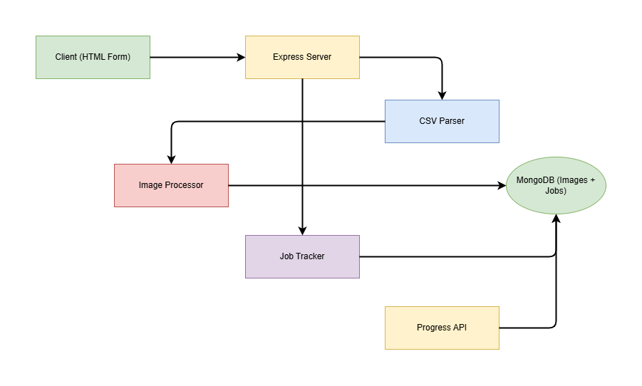

# CSV Image Upload & Processing System

## 📖 Overview
This project implements a Node.js API that allows users to upload a CSV file containing image URLs. The system downloads, compresses, and stores these images in MongoDB. Each upload process is tracked using a Job system, enabling real-time progress monitoring via a dedicated progress API. Invalid URLs and processing errors are also logged in MongoDB for visibility and debugging.

## ⚙️ System Architecture

### System Diagram


## 🛠️ Components and Their Roles

| Component | Description |
|---|---|
| Client (HTML Form) | Uploads CSV file and displays progress URL |
| Express Server | Handles file upload and initiates processing |
| CSV Parser | Reads URLs from CSV |
| Image Processor | Downloads, compresses, and saves images |
| Job Tracker | Tracks progress and errors |
| Progress API | Provides real-time job status |
| MongoDB | Stores images and job records |

## 📁 Folder Structure
```
.
├── public                 # Static HTML form
│   ├── uploadForm.html
├── models                  # MongoDB Schemas
│   ├── Image.js
│   ├── Job.js
├── routes
│   ├── imageRoutes.js      # API routes
├── server.js                # Main application entry point
├── README.md                # Documentation (this file)
└── docs
    ├── system-diagram.png   # Architecture diagram
```

## ⚡ API Endpoints

| Method | Endpoint | Description |
|---|---|---|
| POST | /api/images/upload-csv | Upload CSV file |
| GET | /api/images/progress/:jobId | Check job progress |
| GET | / | Serve upload form |

## ✅ Technologies Used

| Tech | Purpose |
|---|---|
| Node.js | Core runtime |
| Express | API framework |
| Multer | File upload |
| csv-parser | CSV parsing |
| axios | Image download |
| sharp | Image compression |
| MongoDB | Storage |
| uuid | Unique job IDs |

## 🚀 Future Enhancements
- Background worker support
- Retry mechanism for downloads
- Automatic progress polling in client
- Resize options in upload form
